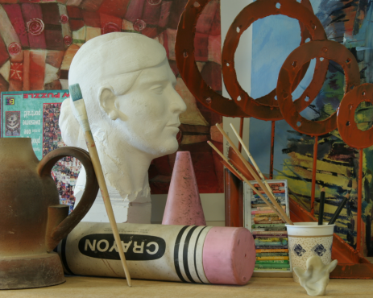
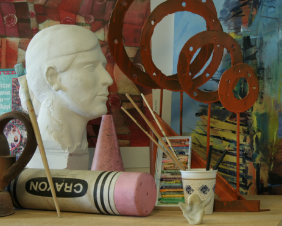
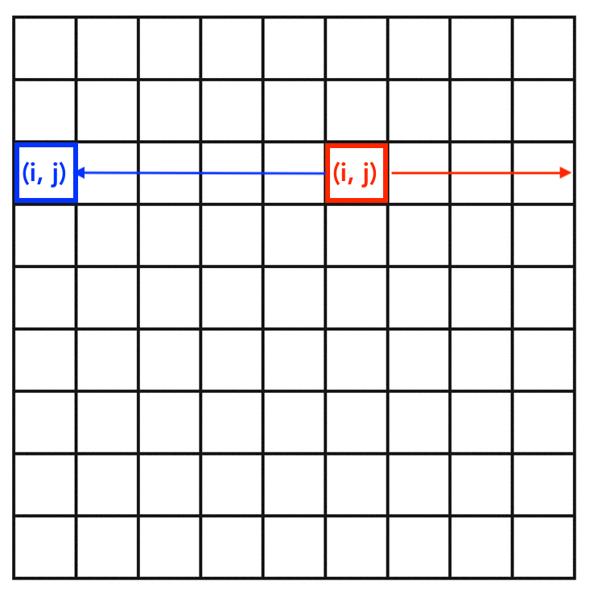

# M3OEP-MPL-helwazir
By Hamzah Elwazir

Video link: https://web.microsoftstream.com/video/9195e60e-4d9d-4496-85fc-3249d235c555
# SSD based disparity estimation in C++
### An intro to disparity
How do you derive 3D information from a 2D image? This is a complicated problem with many solutions. On such solution 
is to use rectified stereo images an calculate the disparity between them. In very general terms disparity is the 
distance that an object moves from one image to another. For example, if we look at the tip of the paintbrush in the 
first image we can see that it has moved to the left in the second image. This difference in position is the disparity.

 

So how do we find depth using disparity? Think about this: as we move our head we can see close objects move their position in our 
vision quite a bit, but if we look at a far off building it doesnt move as much. So, intuitively, points with high 
disparity are closer to the camera and points with lower disparity are farther from the camera. We can now use this to 
estimate the depth of a 2D image.

### How does the code work?
We are estimating disparity using SSD block matching. For each n x n sub-image, where n is the window size, in the left 
image we look at all the n x n sub-images in the right image that are on the same epipolar line (on the same row) in all 
columns before the sub image. the SSD (sum of squared differences) if calculated for these sub images. The minimum SSD 
corresponds with the index of the point in the right image. We can then subtract the index of the point in the left 
image from the point in the right image. That's a little wordy, lets look at a picture



The red box is the window on the left image and the blue box is the window on the right images. For every position the 
red box checks, the blue box checks all equivalent positions in the right image. The SSD for each comparison is 
calculated but only the minimum value is returned.

### Why use C++ and Python?
The code to perform all the necessary calculations has 5 nested for loops and each loop is integral to estimating the 
disparity correctly. Speed becomes a big issue when performing estimations on reasonably sized images. By relegating 
all of the computation to C++ we can speed up the time it takes to generate our estimates and lets us use python for 
reading the images, converting them to csv, and then displaying them.  

## Running the program
First pip needs to be installed. To check if you have pip installed run:
```
python -m pip --version
```
If pip is not installed then you can install it by running:
```
curl https://bootstrap.pypa.io/get-pip.py -o get-pip.py
```
And then running `python get-pip.py` in the folder where get-pip.py was downloaded.


Install openCV by running:
```
pip install opencv-python
```
openCV should install numpy with it, to verify that both openCV and numpy are installed run:
```
python3 -c "import cv2"
python3 -c "import numpy"
```
If a ModuleNotFoundError is thrown then install numpy by running:
```
pip install numpy
```
Once all installations are finished run `python3 image_handling.py`, choose an image set to perform estimation on, and 
enter the desired window size to use for block matching. Once the program is finished running it will display the 
estimated disparity map. 

